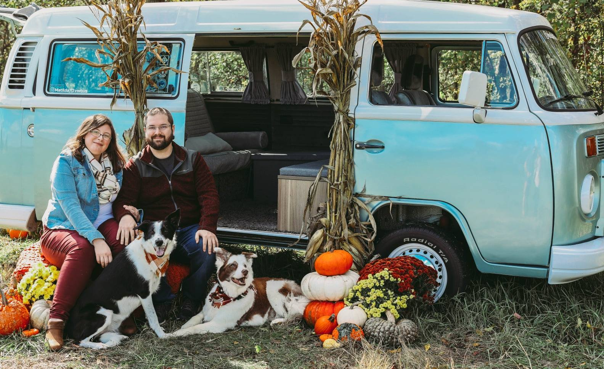

### About Me:

I am currently working as a reporting data analyst for Kellogg's, specializing in Invoice to Cash and deductions. Previously, I worked as a Marketing Database Analyst for Gun Lake Casino. 

I am the mom to two adorable border collies who take up a great deal of my time. 

### Education: 

I graduated from Grand Valley State University in 2019 with my bachelor's in Business Management. Currently, I am working on my masters in Data Science & Analytics from the same university. 

```{r setup, include=FALSE}
knitr::opts_chunk$set(echo = FALSE)

# Learn more about creating websites with Distill at:
# https://rstudio.github.io/distill/website.html

```

